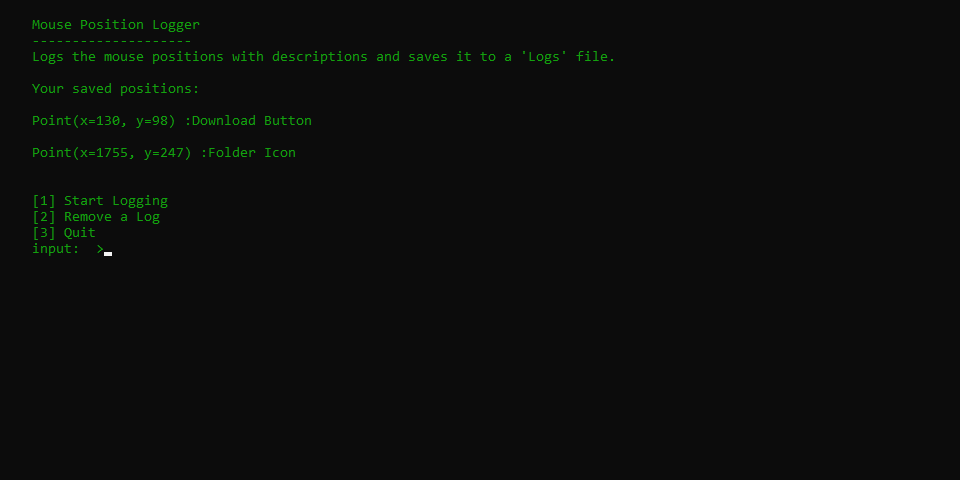

# Mouse Position Logger
This small script helps you to log your mouse positions, in order to use them packages especially like pyautogui. I've created it for myself, you can of course modify for yourself. 

